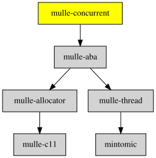

# mulle-concurrent

#### 📶 A lock- and wait-free hashtable (and an array too), written in C

**mulle-concurrent** is a library for lock- and wait-free data structures.
Wait-freeness is a desirable property for "hotly" contested data structures
in multi-threaded environments.

> Many of the ideas are taken from [Preshing on Programming: A Resizable, Concurrent Map](http://preshing.com/20160222/a-resizable-concurrent-map/).
> The definition of concurrent and wait-free are from [concurrencyfreaks.blogspot.de](http://concurrencyfreaks.blogspot.de/2013/05/lock-free-and-wait-free-definition-and.html)


| Release Version                                       | Release Notes  | AI Documentation
|-------------------------------------------------------|----------------|---------------
|  [](//github.com/mulle-concurrent/mulle-concurrent/actions) | [RELEASENOTES](RELEASENOTES.md) | [DeepWiki for mulle-concurrent](https://deepwiki.com/mulle-concurrent/mulle-concurrent)


## API

| Data Structure                                    | Description
| --------------------------------------------------|-----------------------------------
| [`mulle-concurrent-hashmap`](dox/API_HASHMAP.md)  | A wait and lock free hashmap
| [`mulle-concurrent-pointerarray`](dox/API_POINTERARRAY.md)  | A wait and lock free array


## Usage

mulle-concurrent data structures require
[mulle-aba](//github.com/mulle-concurrent/mulle-aba) for safe concurrent memory
reclamation. You must initialize mulle-aba once per process and **register every
thread** that accesses mulle-concurrent data structures.

``` c
#include <mulle-concurrent/mulle-concurrent.h>

int   main( int argc, char *argv[])
{
   struct mulle_concurrent_hashmap   map;

   mulle_aba_init( NULL);                          // once per process
   mulle_aba_register();                           // register main thread

   mulle_concurrent_hashmap_init( &map, 0, NULL);

   // ... use the hashmap ...

   mulle_concurrent_hashmap_done( &map);

   mulle_aba_unregister();                         // unregister main thread
   mulle_aba_done();                               // once per process
   return( 0);
}
```

### Multi-threaded setup

**Every participating thread** must call `mulle_aba_register` before accessing
any mulle-concurrent data structure and `mulle_aba_unregister` before exiting.
Forgetting to do so will crash.

With `mulle_thread` you can automate the unregister with a TSS destructor:

``` c
#include <mulle-concurrent/mulle-concurrent.h>

static mulle_thread_tss_t   aba_tss_key;


static void   aba_thread_destructor( void *value)
{
   mulle_aba_unregister();
}


// call once from main before spawning threads
static void   aba_setup_thread_cleanup( void)
{
   mulle_thread_tss_create( aba_thread_destructor, &aba_tss_key);
}


// call at the start of each thread function
static void   aba_register_thread( void)
{
   mulle_aba_register();
   mulle_thread_tss_set( aba_tss_key, (void *) 1);  // non-NULL triggers destructor
}
```

Then your thread function becomes:

``` c
static void   *my_worker( void *arg)
{
   struct mulle_concurrent_hashmap   *map = arg;

   aba_register_thread();

   // ... safely use map ...

   return( NULL);  // destructor calls mulle_aba_unregister automatically
}
```


### You are here




## Add

**This project is a component of the [mulle-core](//github.com/mulle-core/mulle-core) library. As such you usually will *not* add or install it
individually, unless you specifically do not want to link against
`mulle-core`.**


### Add as an individual component

Use [mulle-sde](//github.com/mulle-sde) to add mulle-concurrent to your project:

``` sh
mulle-sde add github:mulle-concurrent/mulle-concurrent
```

To only add the sources of mulle-concurrent with dependency
sources use [clib](https://github.com/clibs/clib):


``` sh
clib install --out src/mulle-concurrent mulle-concurrent/mulle-concurrent
```

Add `-isystem src/mulle-concurrent` to your `CFLAGS` and compile all the sources that were downloaded with your project.


## Install

Use [mulle-sde](//github.com/mulle-sde) to build and install mulle-concurrent and all dependencies:

``` sh
mulle-sde install --prefix /usr/local \
   https://github.com/mulle-concurrent/mulle-concurrent/archive/latest.tar.gz
```

### Legacy Installation

Install the requirements:

| Requirements                                 | Description
|----------------------------------------------|-----------------------
| [mulle-aba](https://github.com/mulle-concurrent/mulle-aba)             | 🚮 A lock-free, cross-platform solution to the ABA problem

Download the latest [tar](https://github.com/mulle-concurrent/mulle-concurrent/archive/refs/tags/latest.tar.gz) or [zip](https://github.com/mulle-concurrent/mulle-concurrent/archive/refs/tags/latest.zip) archive and unpack it.

Install **mulle-concurrent** into `/usr/local` with [cmake](https://cmake.org):

``` sh
PREFIX_DIR="/usr/local"
cmake -B build                               \
      -DMULLE_SDK_PATH="${PREFIX_DIR}"       \
      -DCMAKE_INSTALL_PREFIX="${PREFIX_DIR}" \
      -DCMAKE_PREFIX_PATH="${PREFIX_DIR}"    \
      -DCMAKE_BUILD_TYPE=Release &&
cmake --build build --config Release &&
cmake --install build --config Release
```


## Author

[Nat!](https://mulle-kybernetik.com/weblog) for Mulle kybernetiK  


